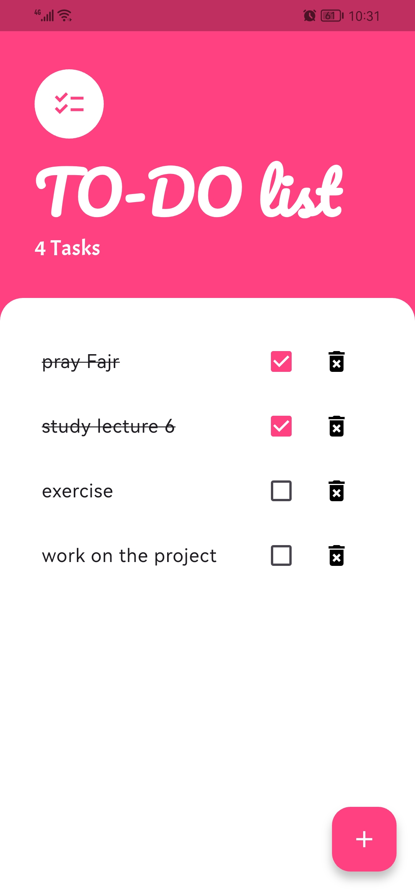

# 📝 To-do App - Your Daily Task Manager

## ✨ Overview

The To-do app is a simple yet effective task manager designed to help you easily track and organize your daily tasks. You can add new tasks, mark them as complete, and delete them. It's a perfect app for managing personal to-do lists.

## 🚀 Features

* **Add New Tasks:** Quickly and easily add new tasks to your list.
* **Mark Tasks as Complete:** Tick off tasks once you've accomplished them.
* **Delete Tasks:** Remove unwanted or completed tasks from your list.
* **Simple User Interface:** Clean and intuitive design for a smooth user experience.

## 📸 Screenshots

## 🛠️ Built With

- Flutter
- Dart
